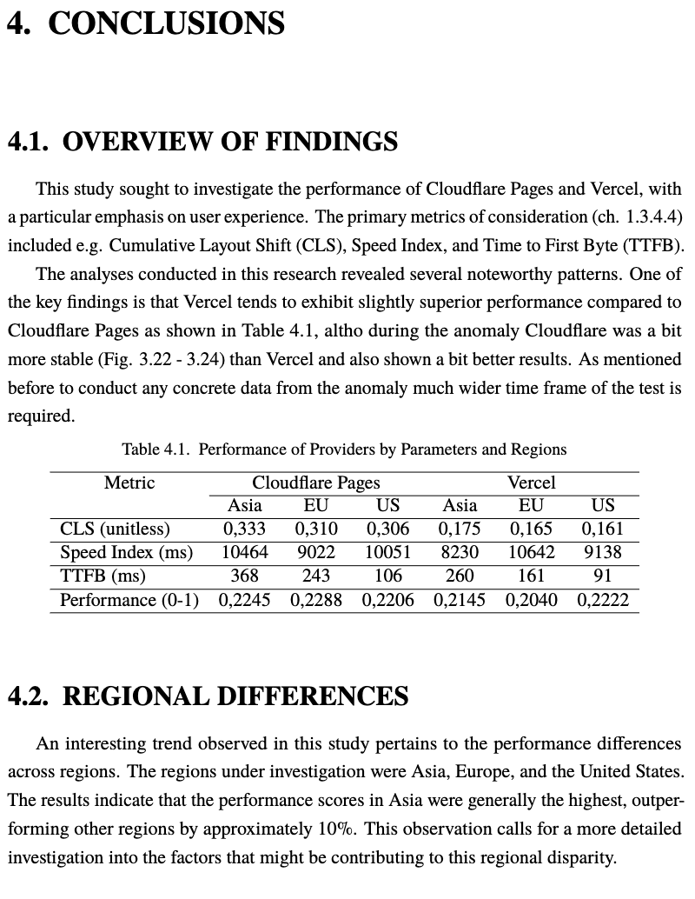

# Performance Analysis of Cloudflare Pages and Vercel

This repository contains the code used for the research and analysis presented in the thesis, "Performance Analysis of Cloudflare Pages and Vercel." The study focused on assessing the user experience and performance metrics of these two popular website hosting platforms, examining key indicators such as Cumulative Layout Shift (CLS), Speed Index, and Time to First Byte (TTFB) across different regions: Asia, Europe, and the United States.

## Table of Contents

- [Introduction](#introduction)
- [Problem Background](#problem-background)
- [Research](#research)
- [Analysis](#analysis)
- [Conclusions](#conclusions)
- [Future Work](#future-work)
- [Repository Structure](#repository-structure)

## Repository Structure

This section explains the purpose of the folders in this repository:

- **README.md:** This file, providing an overview of the repository and its contents.

- **data-extract:** Contains Python scripts used for data extraction. These scripts were used to collect data for performance testing.

- **content-website:** This folder holds the source code for the JAMstack-based content website used in the performance analysis. This website is built using Gatsby.

- **docker-testing:** Contains scripts and configuration files for Docker deployments. It is responsible for deploying the test environment to multiple regions using Terraform. It includes the following important files:
  - `Dockerfile`: Configuration for Docker image building.
  - `entrypoint.sh`: Entry point script for Docker containers.
  - `main.tf`: Terraform configuration for Docker deployments.
  - `terraform_configs`: Directory containing region-specific Terraform configurations for deploying code to various regions.
  - `tf_deploy_all_regions.sh`: Shell script to deploy code to all specified regions.
  - `crontab`: Configuration for scheduled tasks.
  - `lambda`: Folder potentially containing scripts and configurations related to AWS Lambda.
  - `server.js`: JavaScript server script.
  - `test_script.sh`: Script for testing.

- **docker-testing/terraform_configs:** This directory contains configurations for deploying code to multiple regions. The regions include:
  - `ap-southeast-1`: Configuration for deploying to the Asia (Singapore) region.
  - `eu-west-1`: Configuration for deploying to the Europe (Ireland) region.
  - `us-east-1`: Configuration for deploying to the United States (North Virginia) region.

- **simple-website:** This folder contains the source code for a simple website used in the analysis. This website was used for testing and comparing performance metrics.

- **testing-lambda:** Contains scripts and configurations for testing with AWS Lambda. This folder is relevant for performance and anomaly testing.

The folder structure is organized to support different aspects of the research, from data extraction and performance testing to the deployment of various websites and services. The analysis and findings presented in the thesis are based on the data and experiments conducted within these folders.

For more details about each folder's contents and usage, please refer to the specific subdirectories and associated documentation.

# **Below is the short information about the structure of the thesis.**

## Introduction

This section provides an overview of the thesis, its aim, and scope. It introduces the problem background, including concepts related to cloud computing service models, Content Delivery Networks (CDNs), and web services. The study primarily focuses on the JAMstack architecture, website performance, and performance testing.

## Problem Background

This section explores the fundamental concepts related to cloud computing service models (IaaS, PaaS, SaaS), CDNs, CMS as SaaS, web service architecture, and JAMstack architecture. It also covers website performance and performance testing.

## Research

This section outlines the research methodology, including the planning stage, design, deployment, and testing procedures. It provides details on the design of test websites, selection of deployment solutions, test environment setup, and test data storage and analysis.

## Analysis

Here, you can find the detailed analysis of performance metrics for different regions, including Asia, Europe, and the United States. The performance metrics examined include First Meaningful Paint, First Contentful Paint, Cumulative Layout Shift, Max Potential FID, Speed Index, Time to Interactive, and Time to First Byte.

## Conclusions

This section summarizes the key findings of the research, highlighting performance differences between Cloudflare Pages and Vercel for basic and complex websites. It also discusses regional disparities in performance and stability during anomaly events.

## Future Work

In this section, potential areas for future research are identified. These include exploring additional services, changing testing locations, evaluating more extensive JAMstack pages, and discussing practical applications of the research findings.

## Summary

This repository serves as a valuable resource for those interested in the performance analysis of Cloudflare Pages and Vercel. The code and data used in the study are available for reference, and the findings can assist website owners in making informed decisions when choosing a hosting platform.

For more details, please refer to the full thesis document for a comprehensive understanding of the research.

**Authors:** M.Sc., eng. Dominik Ilski

**Date:** 10.07.2023

